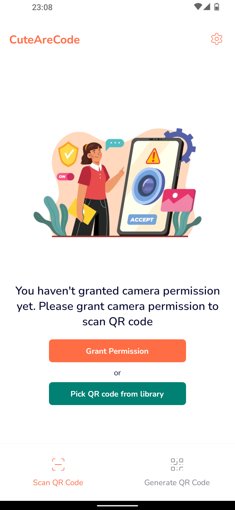
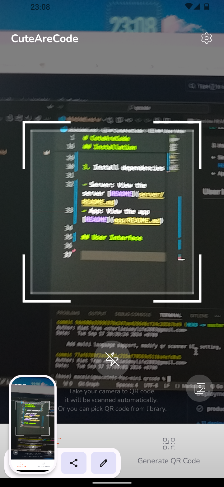
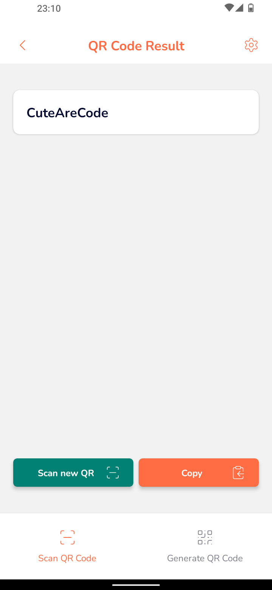
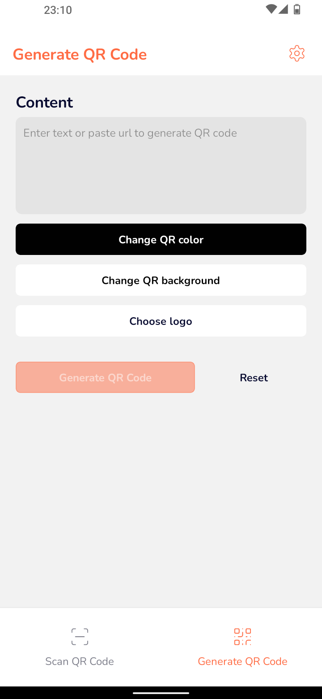
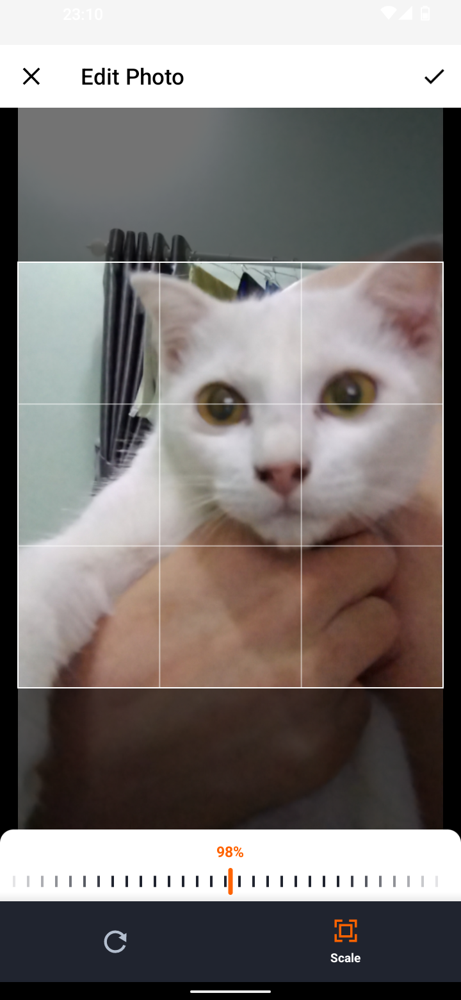
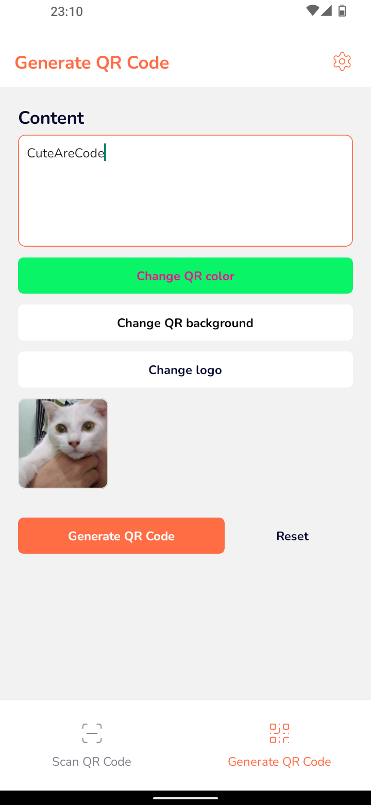
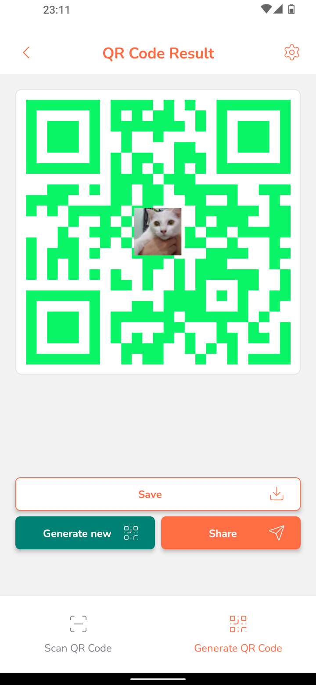
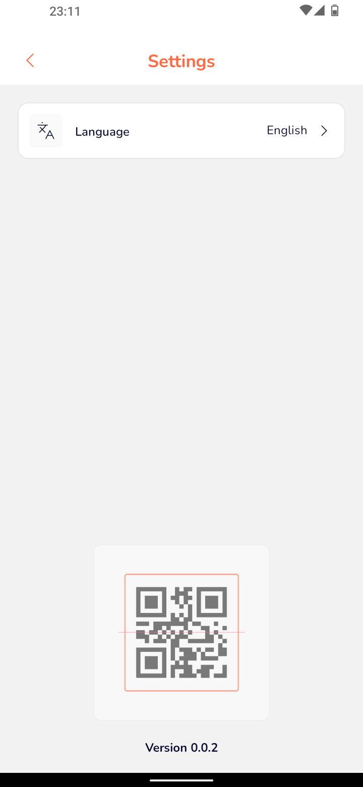
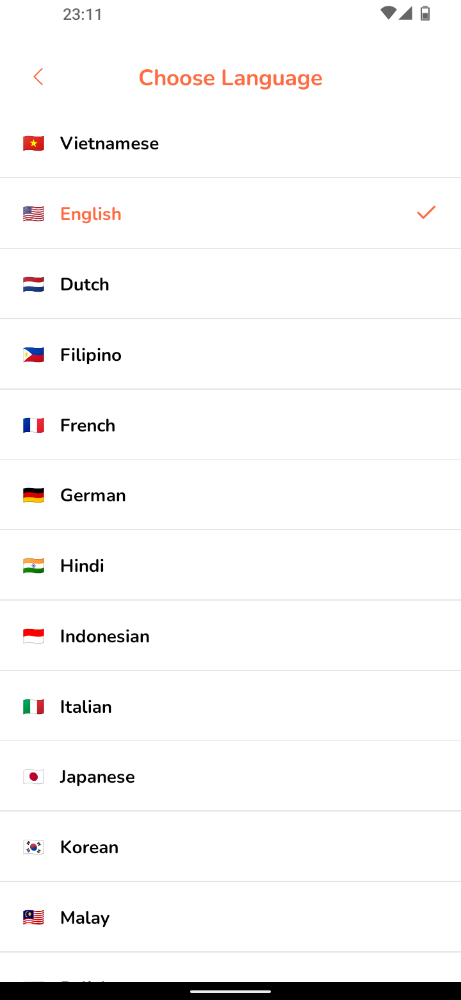

# CuteAreCode

This is a QR code app that help you scan and generate QR code built with React Native and ZXing library (Native Modules).

> **Note**: Currently, the app only focuses on support Android. iOS support will be added in the future.

## Description

This is a QR code app that help you scan and generate QR code built with ExpressJS and React Native.

## Features

- Scan QR code
- Generate QR code
- Save QR code to gallery
- Share QR code
- Copy QR code to clipboard
- Multilanguage support
  - [x] English
  - [x] Vietnamese
  - [x] Dutch
  - [x] Filipino
  - [x] French
  - [x] German
  - [x] Hindi
  - [x] Indonesian
  - [x] Italian
  - [x] Japanese
  - [x] Korean
  - [x] Malay
  - [x] Polish
  - [x] Portuguese
  - [x] Russian
  - [x] Spanish
  - [x] Thai
  - [x] Turkish
  - [x] Chinese
  - [ ] ...

## Preqrequisites

- Node.js (v18 or higher)
- Yarn (v1.22 or higher)
- Android Studio
- Android Emulator or Physical Device
- React Native CLI

## Installation

1. Clone the repository

```bash
git clone https://github.com/Sobee-Project/CuteAreCode.git
```

2. Change directory to the project

```bash
cd CuteAreCode
```

3. Install dependencies

```bash
yarn install
```

If you don't have yarn installed, you can install it by running:

```bash
npm install -g yarn
```

4. Create a key.properties file in the android folder

```bash
touch android/key.properties
```

5. Add the following lines to the key.properties file

```properties
storePassword=<your_store_password>
keyPassword=<your_key_password>
keyAlias=<your_key_alias>
storeFile=<your_store_file>
```

Example:

```properties
storePassword=123456
keyPassword=123456
keyAlias=key
storeFile=./release.keystore
```

6. Create a release keystore file

```bash
keytool -genkey -v -keystore <your_store_file> -alias <your_key_alias> -keyalg RSA -keysize 2048 -validity 10000
```

> **Note**: Your keystore file should be in the `android/app` folder. Your `<your_store_file>` and `<your_key_alias>` should be the same as in the key.properties file.

7. Start the app

```bash
yarn start
```

Click on the following options to run the app:

- `a` - To run android
- `i` - To run ios

## Important

- Make sure you have the server running before starting the app. You can view the server [README](../server/README.md) for more information.
- You have to change the `port` in [`instance.ts`](src/services/instance.ts) to your server port.
- If you're using a physical device, make sure you have enabled USB debugging and use network proxy to connect to the server (ngrok).

## User Interface












## License

This project is licensed under the MIT License - see the [LICENSE](LICENSE) file for details.
