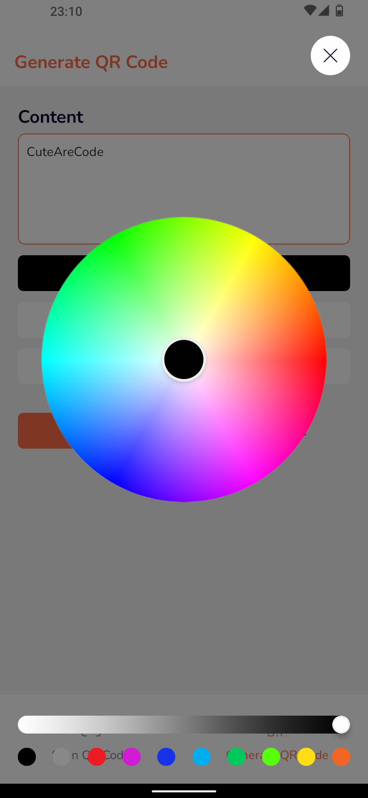

# CuteAreCode

## Description

This is a QR code app that help you scan and generate QR code built with ExpressJS and React Native.

## Features

- Scan QR code
- Generate QR code
- Save QR code to gallery
- Share QR code
- Copy QR code to clipboard
- Multilanguage support
  - [x] English
  - [x] Vietnamese
  - [x] Dutch
  - [x] Filipino
  - [x] French
  - [x] German
  - [x] Hindi
  - [x] Indonesian
  - [x] Italian
  - [x] Japanese
  - [x] Korean
  - [x] Malay
  - [x] Polish
  - [x] Portuguese
  - [x] Russian
  - [x] Spanish
  - [x] Thai
  - [x] Turkish
  - [x] Chinese
  - [ ] ...

## Installation

1. Clone the repository

```bash
git clone https://github.com/Sobee-Project/CuteAreCode.git
```

2. Change directory to the project

```bash
cd CuteAreCode
```

3. Install dependencies

- Server: View the server [README](server/README.md)
- App: View the app [README](app/README.md)

## User Interface





## License

This project is licensed under the MIT License - see the [LICENSE](LICENSE) file for details.
